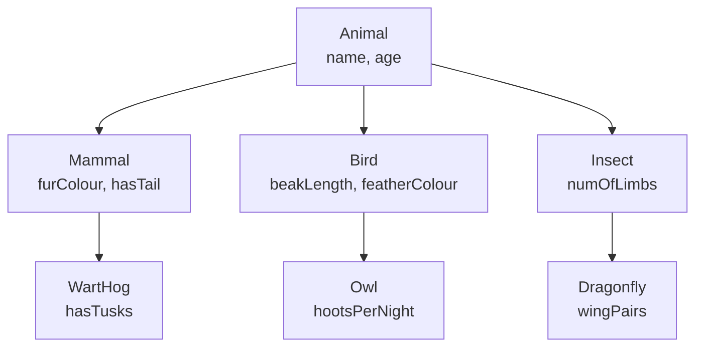
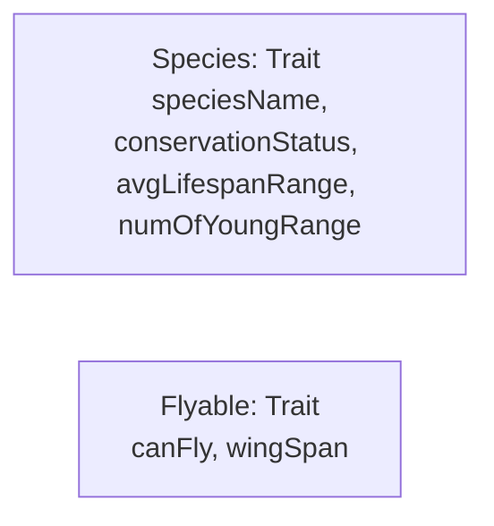
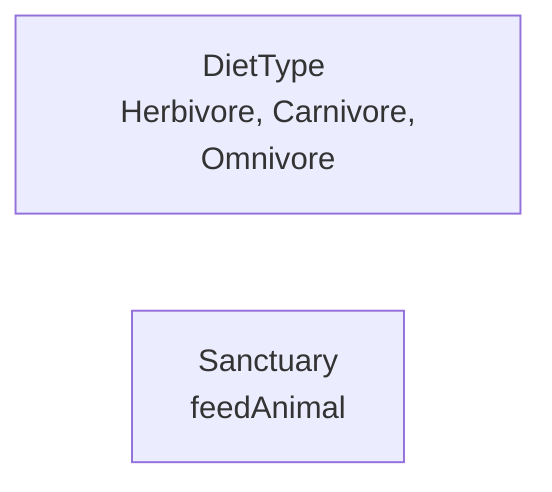

## Afternoon Task: Functions, methods and for comprehensions
### MVP:
Imagine you’re modelling an animal sanctuary in Scala code. What type of Scala constructs would you use? Your task is to first plan it, then to code it.\
TO _NOTE_: This is the first slightly larger, slightly more ambiguous task of the course. Think about making your code clean and readable (hence why the planning is important)!

### Extension
* Do some research into a sealed trait. Use these to represent
different diet types.
* Create an object to represent the sanctuary and add some
animals to it.
* Add some other animals/ animal groups to the model (e.g.
domesticated).

### Research:
* What’s the difference between an abstract class and a trait? Why might you use one over the other?